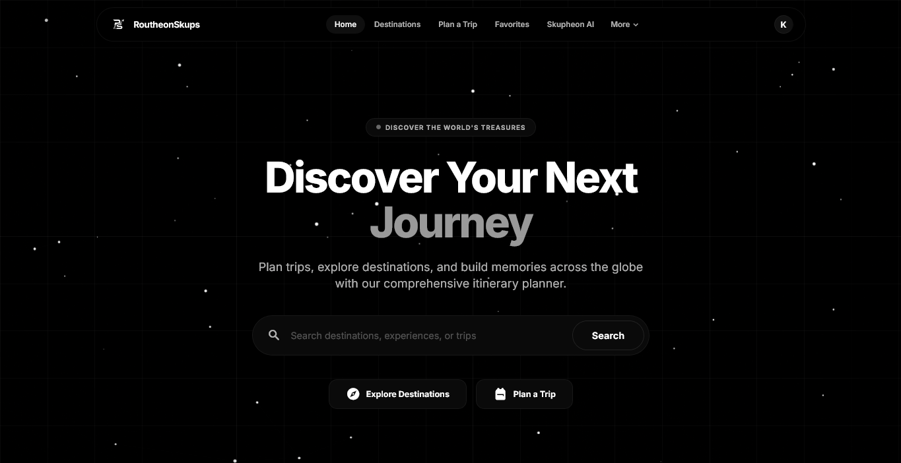
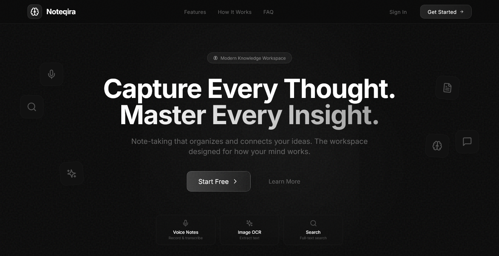
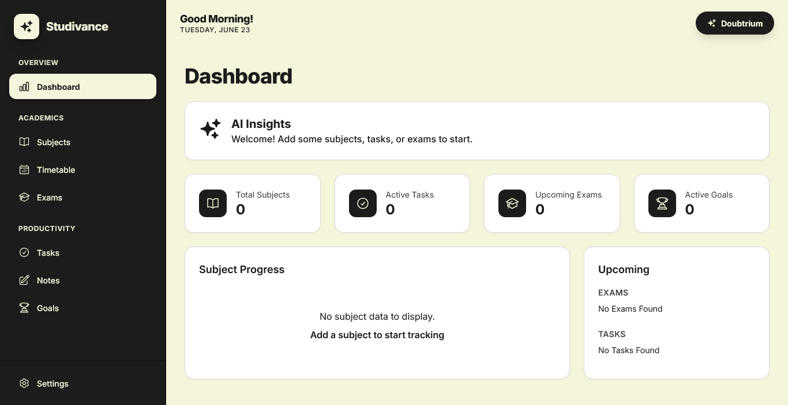

 
 

# S Krishnan

**Aspiring Software Engineer**

 

I design and build modern web applications with a focus on clean interfaces,
intelligent features, and scalable architecture. My work spans full-stack
development, AI-powered tools, and thoughtful user experiences.

---

 

## About Me

I am a software engineer with a deep interest in creating digital solutions that
are both functional and visually refined. I work across the full stack — from
crafting responsive frontends to building robust backend systems — and I
continuously explore new technologies to push the quality of what I build.

Every project I take on is an opportunity to solve meaningful problems, learn
something new, and deliver experiences that feel polished and intentional.

 

## Featured Projects

 

 

**RoutheonSkups** — An AI-powered travel planning application that generates
personalized multi-day itineraries based on user preferences. Built with
intelligent route optimization, dynamic cost estimation, and an interactive map
interface.

 

 

**SQLMind AI** — A platform that transforms plain English into optimized SQL
queries with line-by-line explanations, complexity scoring, and cross-dialect
support. Includes a full AI chat assistant and a Monaco-based editor.

 

 

**Noteqira** — A modern note-taking workspace supporting typed, voice, image,
and document notes. Features a dashboard with analytics, calendar-based review,
OCR, read-aloud playback, and seamless cloud sync.

 

 

**Study Plan AI** — A web-based student planner for managing subjects, daily
tasks, exams, and personalized timetables from a single dashboard. Includes AI
assistance for notes and a dedicated space for asking doubts.

 

 

**Contacts Manager** — A feature-rich, offline-first contact management
platform with AI-powered features, activity logs, calendar events, vCard QR
sharing, and full data import/export capabilities.

 

## Skills and Expertise

Rather than listing technologies, here is what I can do:

**Full-Stack Development** — I build complete web applications from concept to
deployment, handling both client-side interfaces and server-side logic with
equal proficiency.

**AI Applications** — I integrate machine learning models, language models, and
intelligent automation into real-world products that solve practical problems.

**UI/UX Design** — I create interfaces that are clean, responsive, and
intentional — focusing on usability and visual clarity over unnecessary
decoration.

**Cloud and Infrastructure** — I deploy and manage applications using modern
cloud platforms, containerization, and CI/CD workflows.

**Problem Solving** — I approach every challenge with a methodical mindset,
breaking complex problems into simple, maintainable solutions.

 

## Education

**Bachelor of Computer Applications (BCA)**
GLA University, Mathura — 2026 to Present

**Diploma in Computer Engineering and IT Infrastructure**
NTTF, Electronic City, Bengaluru — 2026

**Secondary School Leaving Certificate (SSLC)**
Anikethan Public School, Bengaluru — 2023

 

## How to Explore This Portfolio

This repository contains the source code for my personal portfolio website. Each
section of the site reflects a different aspect of my work and capabilities.

Browse through the codebase to see how the components are structured, how
animations and interactions are implemented, and how the backend integrates with
email services and AI-powered features.

Individual project repositories contain their own detailed documentation,
setup instructions, and live demo links.

 

## Contact

**Email** — sskrishnan03@gmail.com

**LinkedIn** — [linkedin.com/in/s-krishnan-13516b41a](https://www.linkedin.com/in/s-krishnan-13516b41a)

**GitHub** — [github.com/sskrishnan03](https://github.com/sskrishnan03)

**Portfolio** — [s-krishnan-portfolio.vercel.app](https://s-krishnan-portfolio.vercel.app)
